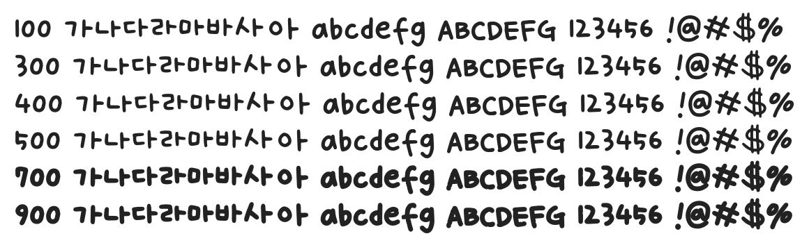

# @noonnu/hs-yuji-regular

HS유지체 - 유지하는게 제일 어렵다



## Install

```bash
npm install @noonnu/hs-yuji-regular --save
```

### Import the CSS file

```js
import '@noonnu/hs-yuji-regular' // esm
// or
require('@noonnu/hs-yuji-regular') // cjs
```

#### [css-loader](https://github.com/webpack-contrib/css-loader)

```css
@import url('~@noonnu/hs-yuji-regular');
```

## Usage

```css
body {
    font-family: HSYuji-Regular;
}
```

## Link

https://noonnu.cc/font_page/737
