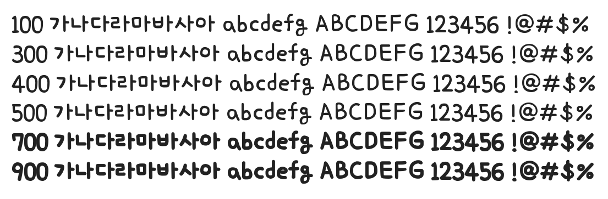

# @noonnu/insungit-cutelivelyjisu

귀염발랄체 - 바다를 헤엄치는 물고기처럼



## Install

```bash
npm install @noonnu/insungit-cutelivelyjisu --save
```

### Import the CSS file

```js
import '@noonnu/insungit-cutelivelyjisu' // esm
// or
require('@noonnu/insungit-cutelivelyjisu') // cjs
```

#### [css-loader](https://github.com/webpack-contrib/css-loader)

```css
@import url('~@noonnu/insungit-cutelivelyjisu');
```

## Usage

```css
body {
    font-family: insungitCutelivelyjisu;
}
```

## Link

https://noonnu.cc/font_page/1049
