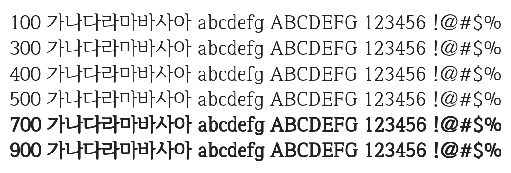

# @noonnu/iropke-batang

이롭게바탕체 - 가볍고 미려한 이롭게 바탕체



## Install

```bash
npm install @noonnu/iropke-batang --save
```

### Import the CSS file

```js
import '@noonnu/iropke-batang' // esm
// or
require('@noonnu/iropke-batang') // cjs
```

#### [css-loader](https://github.com/webpack-contrib/css-loader)

```css
@import url('~@noonnu/iropke-batang');
```

## Usage

```css
body {
    font-family: Iropke Batang;
}
```

## Link

https://noonnu.cc/font_page/4
