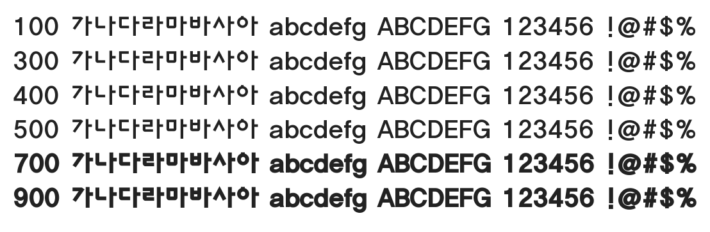

# @noonnu/j-haebaragi-medium-ko

J해바라기 - 해바라기 꽃밭 놀러가고 싶다



## Install

```bash
npm install @noonnu/j-haebaragi-medium-ko --save
```

### Import the CSS file

```js
import '@noonnu/j-haebaragi-medium-ko' // esm
// or
require('@noonnu/j-haebaragi-medium-ko') // cjs
```

#### [css-loader](https://github.com/webpack-contrib/css-loader)

```css
@import url('~@noonnu/j-haebaragi-medium-ko');
```

## Usage

```css
body {
    font-family: JHaebaragi-Medium-KO;
}
```

## Link

https://noonnu.cc/font_page/765
