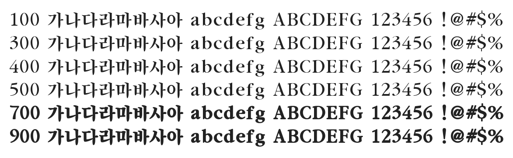

# @noonnu/j-song-myung-regular-ko

J송명 - 정갈한 명조체



## Install

```bash
npm install @noonnu/j-song-myung-regular-ko --save
```

### Import the CSS file

```js
import '@noonnu/j-song-myung-regular-ko' // esm
// or
require('@noonnu/j-song-myung-regular-ko') // cjs
```

#### [css-loader](https://github.com/webpack-contrib/css-loader)

```css
@import url('~@noonnu/j-song-myung-regular-ko');
```

## Usage

```css
body {
    font-family: JSongMyung-Regular-KO;
}
```

## Link

https://noonnu.cc/font_page/766
