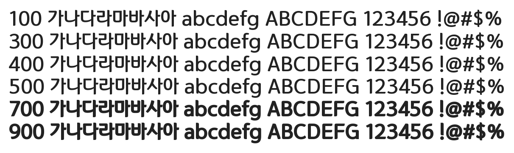

# @noonnu/jal-onuel

잘풀리는오늘체 - 이 폰트를 사용하면 왠지 오늘이 잘 풀릴 것 같다



## Install

```bash
npm install @noonnu/jal-onuel --save
```

### Import the CSS file

```js
import '@noonnu/jal-onuel' // esm
// or
require('@noonnu/jal-onuel') // cjs
```

#### [css-loader](https://github.com/webpack-contrib/css-loader)

```css
@import url('~@noonnu/jal-onuel');
```

## Usage

```css
body {
    font-family: Jal_Onuel;
}
```

## Link

https://noonnu.cc/font_page/497
