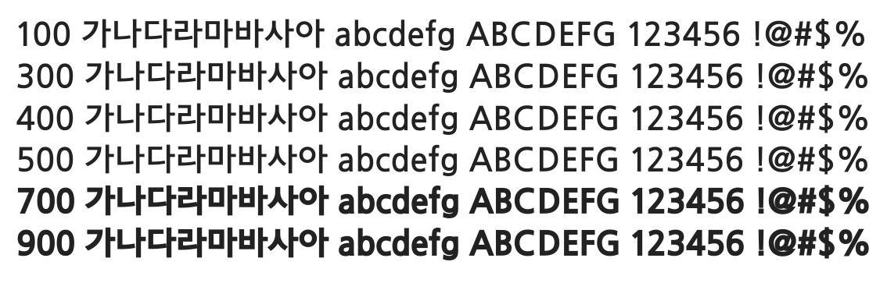

# @noonnu/jeju-gothic

제주고딕 - 여행을 많이 다니다 보면 알게 될거야



## Install

```bash
npm install @noonnu/jeju-gothic --save
```

### Import the CSS file

```js
import '@noonnu/jeju-gothic' // esm
// or
require('@noonnu/jeju-gothic') // cjs
```

#### [css-loader](https://github.com/webpack-contrib/css-loader)

```css
@import url('~@noonnu/jeju-gothic');
```

## Usage

```css
body {
    font-family: Jeju Gothic;
}
```

## Link

https://noonnu.cc/font_page/49
