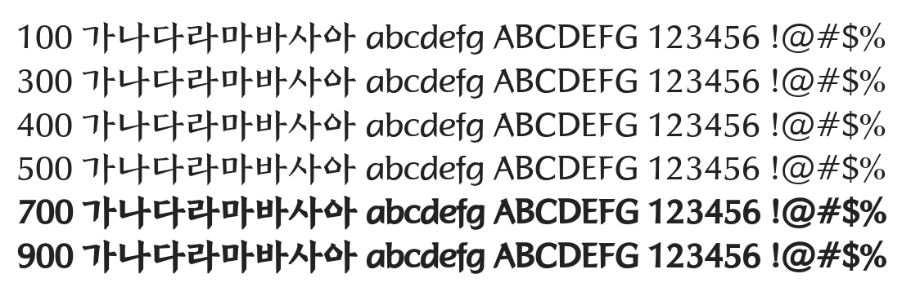

# @noonnu/jeonju-gak-r

전주완판본 각체 - 재택근무 그만하고 사람 좀 만나고 싶다



## Install

```bash
npm install @noonnu/jeonju-gak-r --save
```

### Import the CSS file

```js
import '@noonnu/jeonju-gak-r' // esm
// or
require('@noonnu/jeonju-gak-r') // cjs
```

#### [css-loader](https://github.com/webpack-contrib/css-loader)

```css
@import url('~@noonnu/jeonju-gak-r');
```

## Usage

```css
body {
    font-family: Jeonju_gakR;
}
```

## Link

https://noonnu.cc/font_page/625
