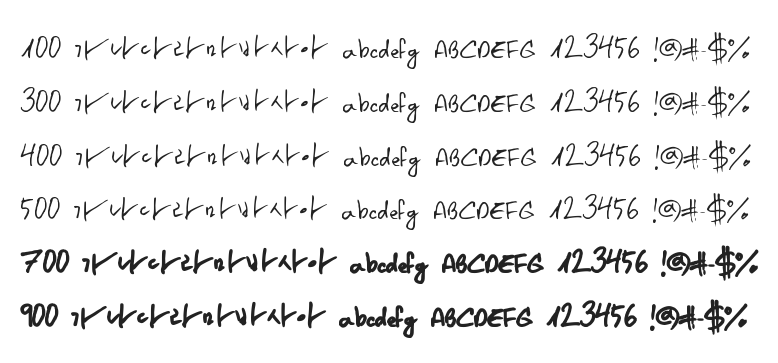

# @noonnu/kanginhan

강인한 위로 - 네이버 클로바 AI가 만든 나눔손글씨 글꼴



## Install

```bash
npm install @noonnu/kanginhan --save
```

### Import the CSS file

```js
import '@noonnu/kanginhan' // esm
// or
require('@noonnu/kanginhan') // cjs
```

#### [css-loader](https://github.com/webpack-contrib/css-loader)

```css
@import url('~@noonnu/kanginhan');
```

## Usage

```css
body {
    font-family: Kanginhan;
}
```

## Link

https://noonnu.cc/font_page/560
