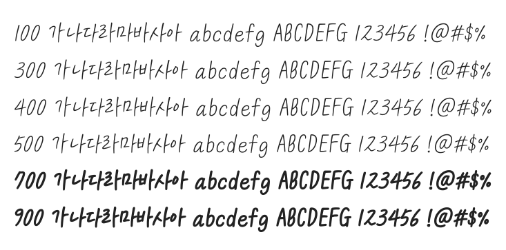

# @noonnu/kcc-eunyoung

KCC은영체 - 들판을 가르는 푸른 바람처럼



## Install

```bash
npm install @noonnu/kcc-eunyoung --save
```

### Import the CSS file

```js
import '@noonnu/kcc-eunyoung' // esm
// or
require('@noonnu/kcc-eunyoung') // cjs
```

#### [css-loader](https://github.com/webpack-contrib/css-loader)

```css
@import url('~@noonnu/kcc-eunyoung');
```

## Usage

```css
body {
    font-family: KCC-eunyoung;
}
```

## Link

https://noonnu.cc/font_page/85
