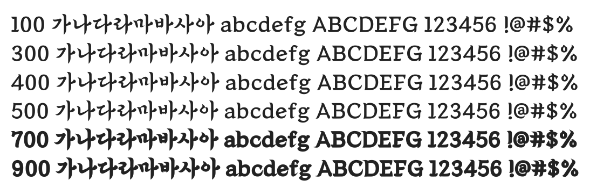

# @noonnu/kdg-medium

솔뫼 김대건체 - 붓글씨 느낌의 자유로운 필체



## Install

```bash
npm install @noonnu/kdg-medium --save
```

### Import the CSS file

```js
import '@noonnu/kdg-medium' // esm
// or
require('@noonnu/kdg-medium') // cjs
```

#### [css-loader](https://github.com/webpack-contrib/css-loader)

```css
@import url('~@noonnu/kdg-medium');
```

## Usage

```css
body {
    font-family: kdg_Medium;
}
```

## Link

https://noonnu.cc/font_page/506
