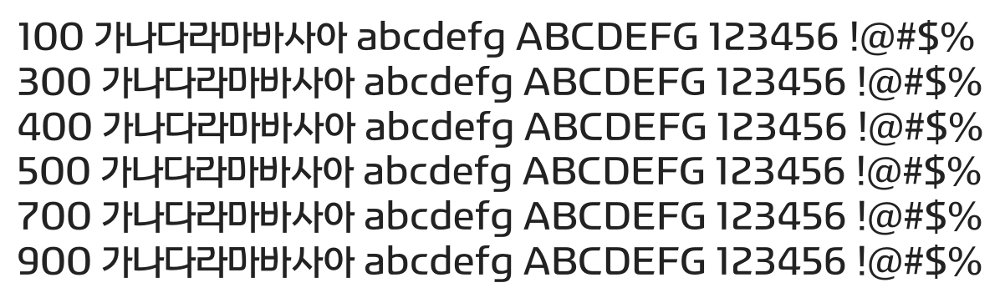

# @noonnu/khnphd

한수원 한돋움체 - 아침 잘 챙겨먹고 다녀



## Install

```bash
npm install @noonnu/khnphd --save
```

### Import the CSS file

```js
import '@noonnu/khnphd' // esm
// or
require('@noonnu/khnphd') // cjs
```

#### [css-loader](https://github.com/webpack-contrib/css-loader)

```css
@import url('~@noonnu/khnphd');
```

## Usage

```css
body {
    font-family: KHNPHD;
}
```

## Link

https://noonnu.cc/font_page/9
