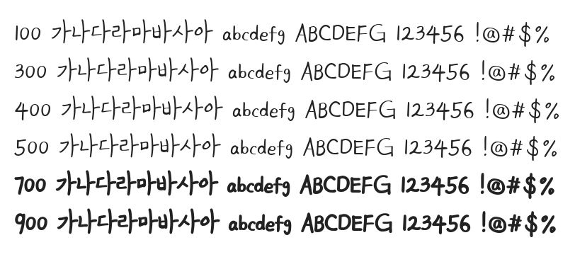

# @noonnu/kim-namyun

김남윤체 - 변화는 당신으로부터 이루어져요



## Install

```bash
npm install @noonnu/kim-namyun --save
```

### Import the CSS file

```js
import '@noonnu/kim-namyun' // esm
// or
require('@noonnu/kim-namyun') // cjs
```

#### [css-loader](https://github.com/webpack-contrib/css-loader)

```css
@import url('~@noonnu/kim-namyun');
```

## Usage

```css
body {
    font-family: KimNamyun;
}
```

## Link

https://noonnu.cc/font_page/22
