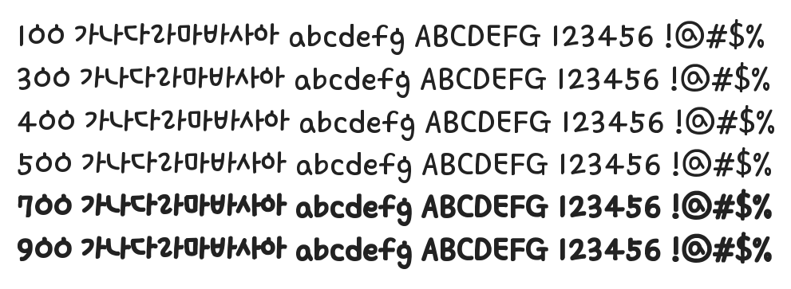

# @noonnu/knps-bandali-regular00

국립공원 반달이 - 반달가슴곰 반달이



## Install

```bash
npm install @noonnu/knps-bandali-regular00 --save
```

### Import the CSS file

```js
import '@noonnu/knps-bandali-regular00' // esm
// or
require('@noonnu/knps-bandali-regular00') // cjs
```

#### [css-loader](https://github.com/webpack-contrib/css-loader)

```css
@import url('~@noonnu/knps-bandali-regular00');
```

## Usage

```css
body {
    font-family: KNPSBandali-Regular00;
}
```

## Link

https://noonnu.cc/font_page/811
