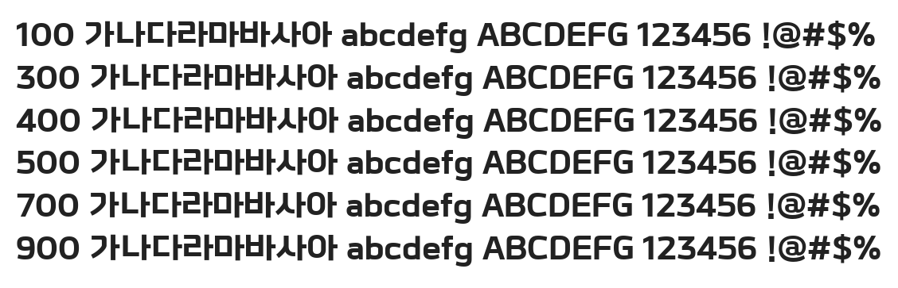

# @noonnu/kofih-dr-leejwttf-b

KOFIH이종욱체 - 기분좋은 가을의 산책길



## Install

```bash
npm install @noonnu/kofih-dr-leejwttf-b --save
```

### Import the CSS file

```js
import '@noonnu/kofih-dr-leejwttf-b' // esm
// or
require('@noonnu/kofih-dr-leejwttf-b') // cjs
```

#### [css-loader](https://github.com/webpack-contrib/css-loader)

```css
@import url('~@noonnu/kofih-dr-leejwttf-b');
```

## Usage

```css
body {
    font-family: KOFIHDrLEEJWTTF-B;
}
```

## Link

https://noonnu.cc/font_page/1040
