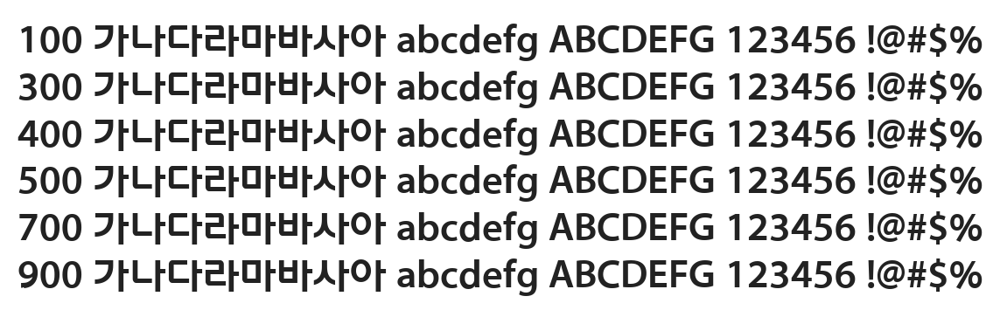

# @noonnu/korail-round-gothic-bold

코레일 둥근고딕 - 어떻게 전철없이 살겠어



## Install

```bash
npm install @noonnu/korail-round-gothic-bold --save
```

### Import the CSS file

```js
import '@noonnu/korail-round-gothic-bold' // esm
// or
require('@noonnu/korail-round-gothic-bold') // cjs
```

#### [css-loader](https://github.com/webpack-contrib/css-loader)

```css
@import url('~@noonnu/korail-round-gothic-bold');
```

## Usage

```css
body {
    font-family: KorailRoundGothicBold;
}
```

## Link

https://noonnu.cc/font_page/1072
