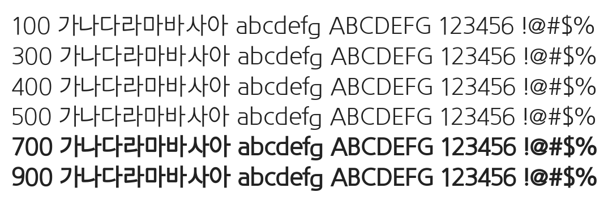

# @noonnu/kotra-gothic

코트라 고딕체 - 가을은 왜 이렇게 짧은거야



## Install

```bash
npm install @noonnu/kotra-gothic --save
```

### Import the CSS file

```js
import '@noonnu/kotra-gothic' // esm
// or
require('@noonnu/kotra-gothic') // cjs
```

#### [css-loader](https://github.com/webpack-contrib/css-loader)

```css
@import url('~@noonnu/kotra-gothic');
```

## Usage

```css
body {
    font-family: KOTRA_GOTHIC;
}
```

## Link

https://noonnu.cc/font_page/484
