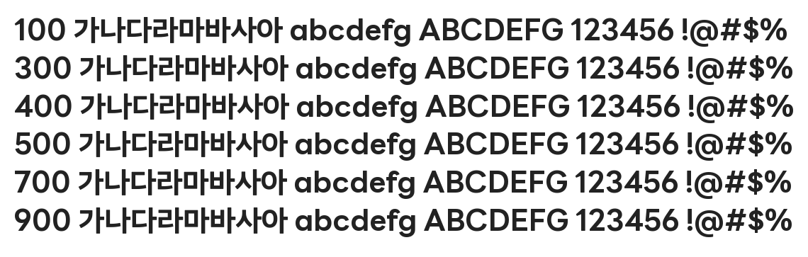

# @noonnu/line-seed-kr-bd

LINE Seed - 라인의 첫 글꼴



## Install

```bash
npm install @noonnu/line-seed-kr-bd --save
```

### Import the CSS file

```js
import '@noonnu/line-seed-kr-bd' // esm
// or
require('@noonnu/line-seed-kr-bd') // cjs
```

#### [css-loader](https://github.com/webpack-contrib/css-loader)

```css
@import url('~@noonnu/line-seed-kr-bd');
```

## Usage

```css
body {
    font-family: LINESeedKR-Bd;
}
```

## Link

https://noonnu.cc/font_page/1050
