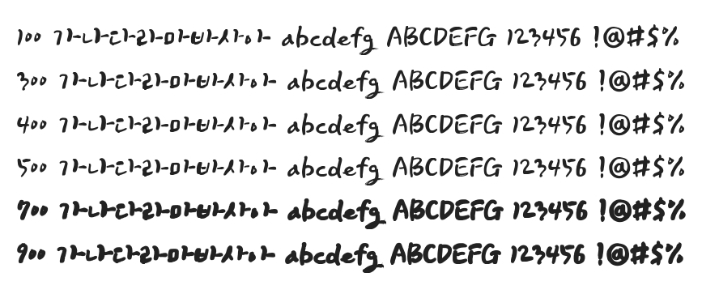

# @noonnu/makgeolli

포천막걸리체 - 포천하면 역시 갈비지 갈비 맛있어



## Install

```bash
npm install @noonnu/makgeolli --save
```

### Import the CSS file

```js
import '@noonnu/makgeolli' // esm
// or
require('@noonnu/makgeolli') // cjs
```

#### [css-loader](https://github.com/webpack-contrib/css-loader)

```css
@import url('~@noonnu/makgeolli');
```

## Usage

```css
body {
    font-family: Makgeolli;
}
```

## Link

https://noonnu.cc/font_page/74
