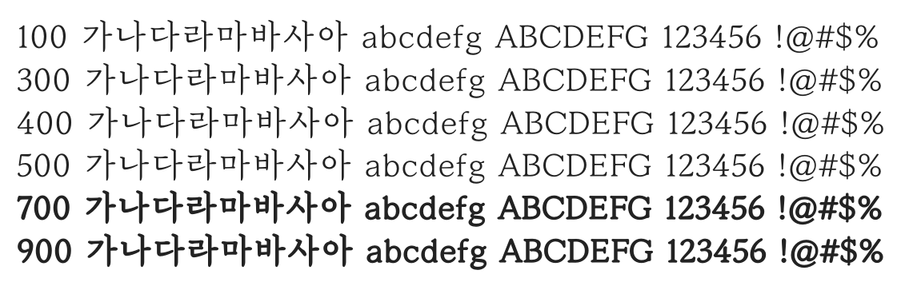

# @noonnu/mapo-golden-pier

마포금빛나루 - 노을빛으로 물든 마포나루



## Install

```bash
npm install @noonnu/mapo-golden-pier --save
```

### Import the CSS file

```js
import '@noonnu/mapo-golden-pier' // esm
// or
require('@noonnu/mapo-golden-pier') // cjs
```

#### [css-loader](https://github.com/webpack-contrib/css-loader)

```css
@import url('~@noonnu/mapo-golden-pier');
```

## Usage

```css
body {
    font-family: MapoGoldenPier;
}
```

## Link

https://noonnu.cc/font_page/382
