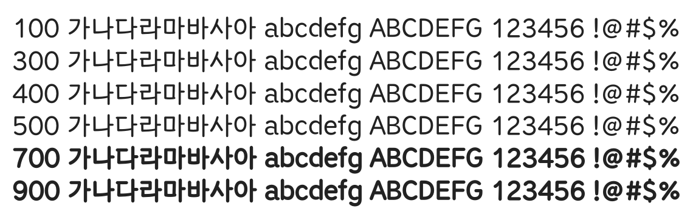

# @noonnu/mapo-peacefull

마포한아름 - 평화의 메시지를 나타내는 폰트



## Install

```bash
npm install @noonnu/mapo-peacefull --save
```

### Import the CSS file

```js
import '@noonnu/mapo-peacefull' // esm
// or
require('@noonnu/mapo-peacefull') // cjs
```

#### [css-loader](https://github.com/webpack-contrib/css-loader)

```css
@import url('~@noonnu/mapo-peacefull');
```

## Usage

```css
body {
    font-family: MapoPeacefull;
}
```

## Link

https://noonnu.cc/font_page/385
