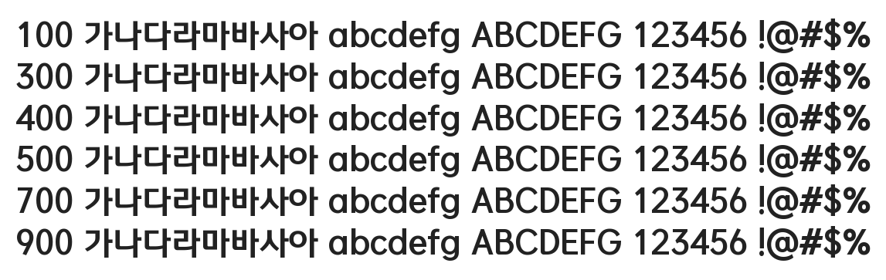

# @noonnu/mice-gothic-bold

MICE고딕 - 파릇파릇 이파리가 많이 나온다



## Install

```bash
npm install @noonnu/mice-gothic-bold --save
```

### Import the CSS file

```js
import '@noonnu/mice-gothic-bold' // esm
// or
require('@noonnu/mice-gothic-bold') // cjs
```

#### [css-loader](https://github.com/webpack-contrib/css-loader)

```css
@import url('~@noonnu/mice-gothic-bold');
```

## Usage

```css
body {
    font-family: MICEGothic Bold;
}
```

## Link

https://noonnu.cc/font_page/932
