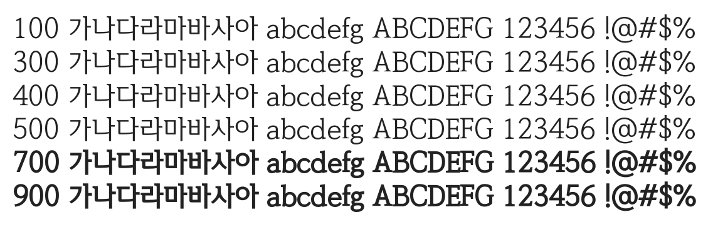

# @noonnu/mice-myungjo

MICE명조 - 가지를 쳐서 물꽂이를 해보자



## Install

```bash
npm install @noonnu/mice-myungjo --save
```

### Import the CSS file

```js
import '@noonnu/mice-myungjo' // esm
// or
require('@noonnu/mice-myungjo') // cjs
```

#### [css-loader](https://github.com/webpack-contrib/css-loader)

```css
@import url('~@noonnu/mice-myungjo');
```

## Usage

```css
body {
    font-family: MICEMyungjo;
}
```

## Link

https://noonnu.cc/font_page/934
