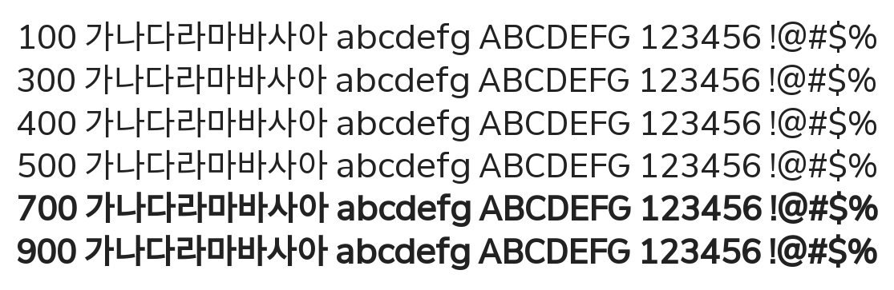

# @noonnu/min-sans-regular

민산스 - 사람 눈치 안보고 살고 싶다



## Install

```bash
npm install @noonnu/min-sans-regular --save
```

### Import the CSS file

```js
import '@noonnu/min-sans-regular' // esm
// or
require('@noonnu/min-sans-regular') // cjs
```

#### [css-loader](https://github.com/webpack-contrib/css-loader)

```css
@import url('~@noonnu/min-sans-regular');
```

## Usage

```css
body {
    font-family: MinSans-Regular;
}
```

## Link

https://noonnu.cc/font_page/828
