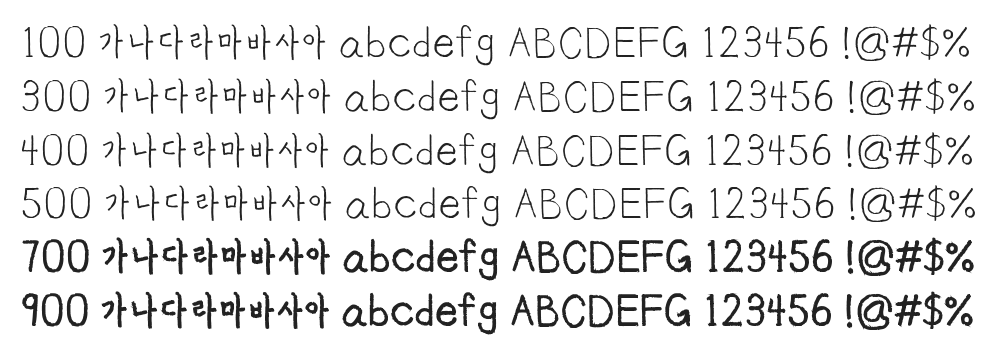

# @noonnu/mingijuk

밍기적체 - 밍기적거리면서 유튜브를 보자



## Install

```bash
npm install @noonnu/mingijuk --save
```

### Import the CSS file

```js
import '@noonnu/mingijuk' // esm
// or
require('@noonnu/mingijuk') // cjs
```

#### [css-loader](https://github.com/webpack-contrib/css-loader)

```css
@import url('~@noonnu/mingijuk');
```

## Usage

```css
body {
    font-family: Mingijuk;
}
```

## Link

https://noonnu.cc/font_page/665
