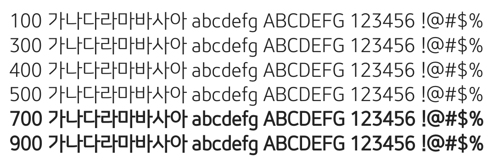

# @noonnu/minguk-regular

민국체 - 다들 적게 일하고 많이 버세요



## Install

```bash
npm install @noonnu/minguk-regular --save
```

### Import the CSS file

```js
import '@noonnu/minguk-regular' // esm
// or
require('@noonnu/minguk-regular') // cjs
```

#### [css-loader](https://github.com/webpack-contrib/css-loader)

```css
@import url('~@noonnu/minguk-regular');
```

## Usage

```css
body {
    font-family: Minguk-Regular;
}
```

## Link

https://noonnu.cc/font_page/337
