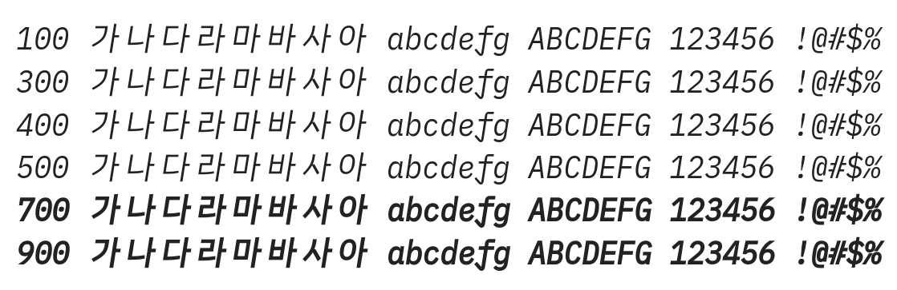

# @noonnu/monoplex-kr-italic

모노플렉스KR Italic - IBM Plex 폰트를 활용한 폰트



## Install

```bash
npm install @noonnu/monoplex-kr-italic --save
```

### Import the CSS file

```js
import '@noonnu/monoplex-kr-italic' // esm
// or
require('@noonnu/monoplex-kr-italic') // cjs
```

#### [css-loader](https://github.com/webpack-contrib/css-loader)

```css
@import url('~@noonnu/monoplex-kr-italic');
```

## Usage

```css
body {
    font-family: MonoplexKR-Italic;
}
```

## Link

https://noonnu.cc/font_page/968
