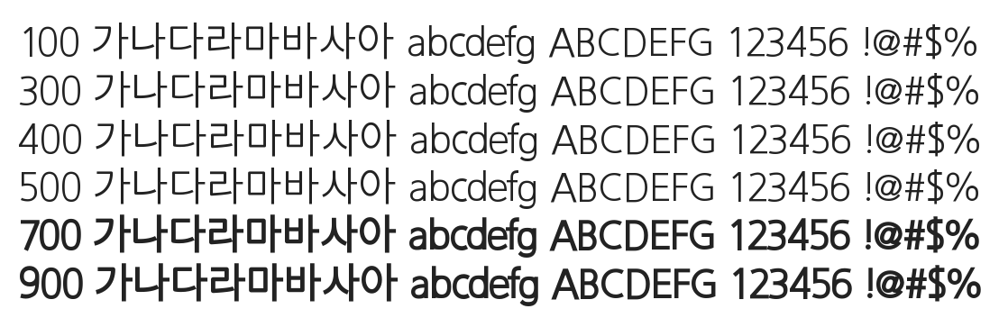

# @noonnu/my-arirang-gothic

밀양아리랑고딕체 - 밀양 여행도 재밌으려나



## Install

```bash
npm install @noonnu/my-arirang-gothic --save
```

### Import the CSS file

```js
import '@noonnu/my-arirang-gothic' // esm
// or
require('@noonnu/my-arirang-gothic') // cjs
```

#### [css-loader](https://github.com/webpack-contrib/css-loader)

```css
@import url('~@noonnu/my-arirang-gothic');
```

## Usage

```css
body {
    font-family: MYArirang_gothic;
}
```

## Link

https://noonnu.cc/font_page/941
