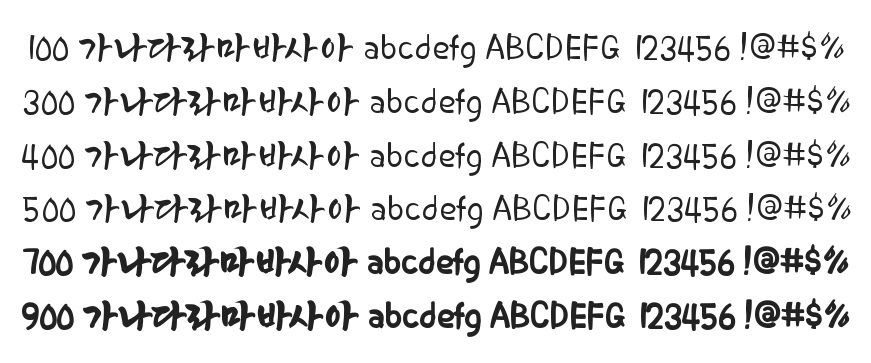

# @noonnu/my-haemalgeun-sangsang

밀양해맑은상상체 - 예쁜구름이 다 비구름이었나



## Install

```bash
npm install @noonnu/my-haemalgeun-sangsang --save
```

### Import the CSS file

```js
import '@noonnu/my-haemalgeun-sangsang' // esm
// or
require('@noonnu/my-haemalgeun-sangsang') // cjs
```

#### [css-loader](https://github.com/webpack-contrib/css-loader)

```css
@import url('~@noonnu/my-haemalgeun-sangsang');
```

## Usage

```css
body {
    font-family: MYHaemalgeunSangsang;
}
```

## Link

https://noonnu.cc/font_page/943
