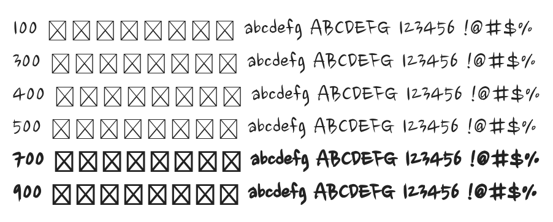

# @noonnu/nanum-brush-script

나눔손글씨붓 - 눈치 안보는 척하는 것도 눈치인 거야



## Install

```bash
npm install @noonnu/nanum-brush-script --save
```

### Import the CSS file

```js
import '@noonnu/nanum-brush-script' // esm
// or
require('@noonnu/nanum-brush-script') // cjs
```

#### [css-loader](https://github.com/webpack-contrib/css-loader)

```css
@import url('~@noonnu/nanum-brush-script');
```

## Usage

```css
body {
    font-family: Nanum Brush Script;
}
```

## Link

https://noonnu.cc/font_page/43
