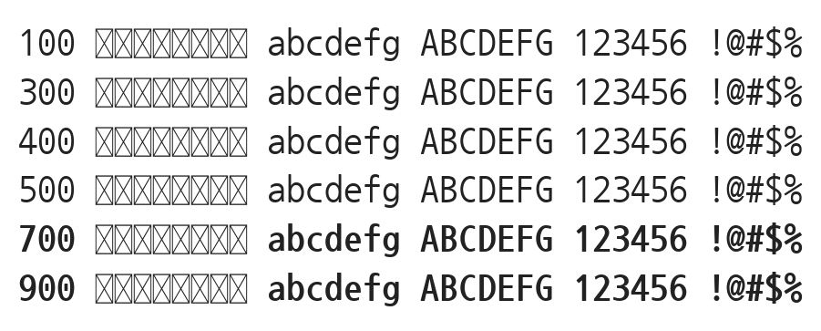

# @noonnu/nanum-gothic-coding

나눔고딕코딩 - class Noonnu; end



## Install

```bash
npm install @noonnu/nanum-gothic-coding --save
```

### Import the CSS file

```js
import '@noonnu/nanum-gothic-coding' // esm
// or
require('@noonnu/nanum-gothic-coding') // cjs
```

#### [css-loader](https://github.com/webpack-contrib/css-loader)

```css
@import url('~@noonnu/nanum-gothic-coding');
```

## Usage

```css
body {
    font-family: Nanum Gothic Coding;
}
```

## Link

https://noonnu.cc/font_page/40
