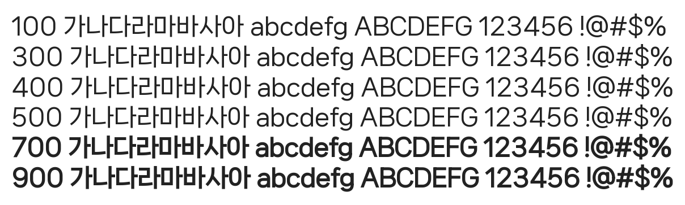

# @noonnu/nanum-square-neo-variable

나눔스퀘어 네오 - 하늘을 헤엄치는 구름처럼



## Install

```bash
npm install @noonnu/nanum-square-neo-variable --save
```

### Import the CSS file

```js
import '@noonnu/nanum-square-neo-variable' // esm
// or
require('@noonnu/nanum-square-neo-variable') // cjs
```

#### [css-loader](https://github.com/webpack-contrib/css-loader)

```css
@import url('~@noonnu/nanum-square-neo-variable');
```

## Usage

```css
body {
    font-family: NanumSquareNeo-Variable;
}
```

## Link

https://noonnu.cc/font_page/1053
