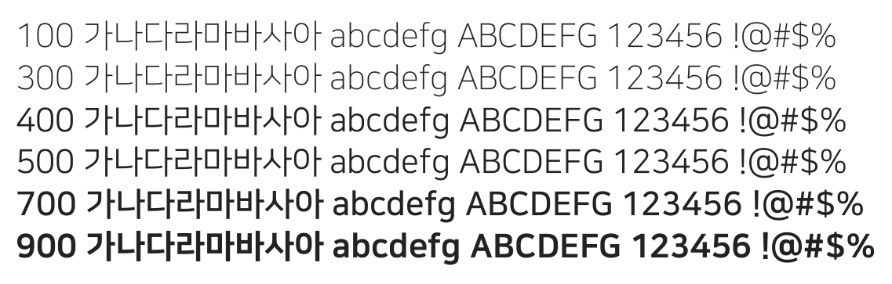

# @noonnu/nanum-square

나눔스퀘어 - 너도 떠나보면 나를 알게 될거야



## Install

```bash
npm install @noonnu/nanum-square --save
```

### Import the CSS file

```js
import '@noonnu/nanum-square' // esm
// or
require('@noonnu/nanum-square') // cjs
```

#### [css-loader](https://github.com/webpack-contrib/css-loader)

```css
@import url('~@noonnu/nanum-square');
```

## Usage

```css
body {
    font-family: NanumSquare;
}
```

## Link

https://noonnu.cc/font_page/37
