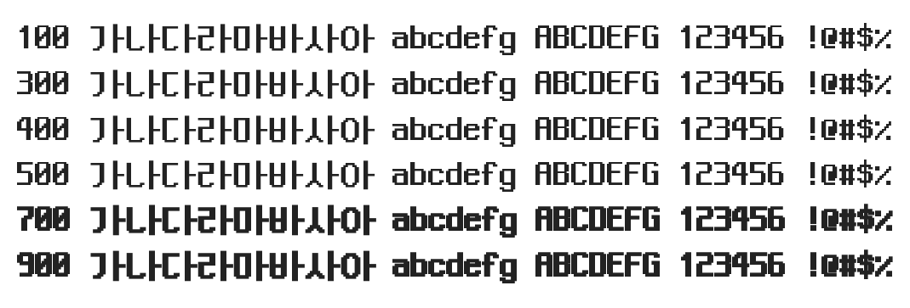

# @noonnu/neo-dunggeunmo

Neo둥근모 - 새로운 비트맵 한글 글꼴 둥근모꼴



## Install

```bash
npm install @noonnu/neo-dunggeunmo --save
```

### Import the CSS file

```js
import '@noonnu/neo-dunggeunmo' // esm
// or
require('@noonnu/neo-dunggeunmo') // cjs
```

#### [css-loader](https://github.com/webpack-contrib/css-loader)

```css
@import url('~@noonnu/neo-dunggeunmo');
```

## Usage

```css
body {
    font-family: NeoDunggeunmo;
}
```

## Link

https://noonnu.cc/font_page/386
