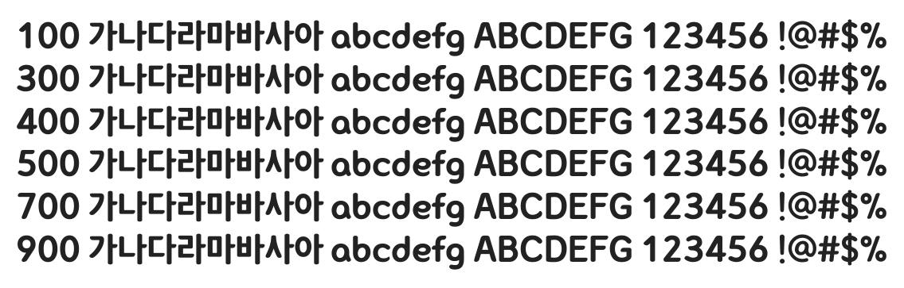

# @noonnu/netmarble-b

넷마블체 - 넷마블 캐릭터 크크 귀엽더라



## Install

```bash
npm install @noonnu/netmarble-b --save
```

### Import the CSS file

```js
import '@noonnu/netmarble-b' // esm
// or
require('@noonnu/netmarble-b') // cjs
```

#### [css-loader](https://github.com/webpack-contrib/css-loader)

```css
@import url('~@noonnu/netmarble-b');
```

## Usage

```css
body {
    font-family: netmarbleB;
}
```

## Link

https://noonnu.cc/font_page/118
