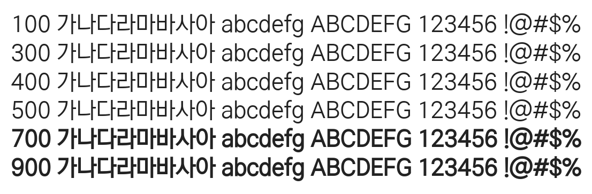

# @noonnu/nexon-lv2-gothic

넥슨 Lv.2 고딕 - 올려야하는 폰트가 너무너무 많다..



## Install

```bash
npm install @noonnu/nexon-lv2-gothic --save
```

### Import the CSS file

```js
import '@noonnu/nexon-lv2-gothic' // esm
// or
require('@noonnu/nexon-lv2-gothic') // cjs
```

#### [css-loader](https://github.com/webpack-contrib/css-loader)

```css
@import url('~@noonnu/nexon-lv2-gothic');
```

## Usage

```css
body {
    font-family: NEXON Lv2 Gothic;
}
```

## Link

https://noonnu.cc/font_page/435
