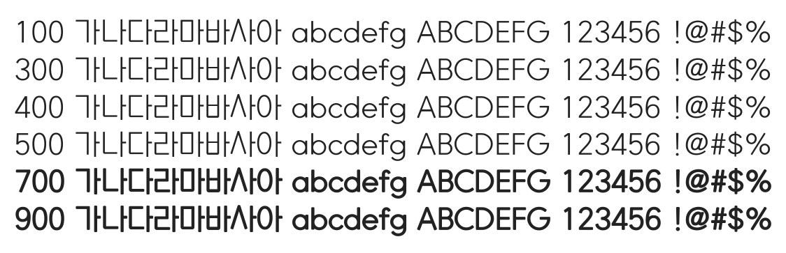

# @noonnu/nixgonm-vb

닉스곤폰트 - 마지막 가는 길이 편했으면



## Install

```bash
npm install @noonnu/nixgonm-vb --save
```

### Import the CSS file

```js
import '@noonnu/nixgonm-vb' // esm
// or
require('@noonnu/nixgonm-vb') // cjs
```

#### [css-loader](https://github.com/webpack-contrib/css-loader)

```css
@import url('~@noonnu/nixgonm-vb');
```

## Usage

```css
body {
    font-family: NIXGONM-Vb;
}
```

## Link

https://noonnu.cc/font_page/219
