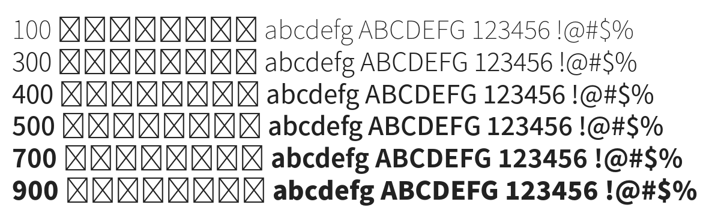

# @noonnu/noto-sans-kr

본고딕 (Noto Sans) - 니편내편이 어딨어 세상 다 혼자 사는거지



## Install

```bash
npm install @noonnu/noto-sans-kr --save
```

### Import the CSS file

```js
import '@noonnu/noto-sans-kr' // esm
// or
require('@noonnu/noto-sans-kr') // cjs
```

#### [css-loader](https://github.com/webpack-contrib/css-loader)

```css
@import url('~@noonnu/noto-sans-kr');
```

## Usage

```css
body {
    font-family: Noto Sans KR;
}
```

## Link

https://noonnu.cc/font_page/34
