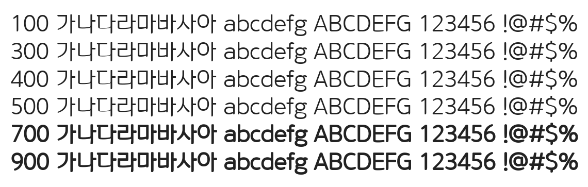

# @noonnu/o-seongand-han-eum

포천오성과한음체 - 오성과 한음은 꼬맹이도 알죠



## Install

```bash
npm install @noonnu/o-seongand-han-eum --save
```

### Import the CSS file

```js
import '@noonnu/o-seongand-han-eum' // esm
// or
require('@noonnu/o-seongand-han-eum') // cjs
```

#### [css-loader](https://github.com/webpack-contrib/css-loader)

```css
@import url('~@noonnu/o-seongand-han-eum');
```

## Usage

```css
body {
    font-family: OSeongandHanEum;
}
```

## Link

https://noonnu.cc/font_page/73
