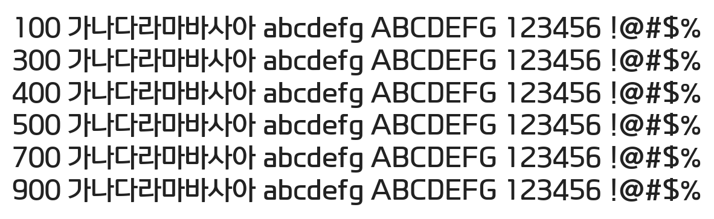

# @noonnu/paybooc-bold

페이북 글꼴 - 상큼한 사과에이드 마시고 싶다



## Install

```bash
npm install @noonnu/paybooc-bold --save
```

### Import the CSS file

```js
import '@noonnu/paybooc-bold' // esm
// or
require('@noonnu/paybooc-bold') // cjs
```

#### [css-loader](https://github.com/webpack-contrib/css-loader)

```css
@import url('~@noonnu/paybooc-bold');
```

## Usage

```css
body {
    font-family: paybooc-Bold;
}
```

## Link

https://noonnu.cc/font_page/452
