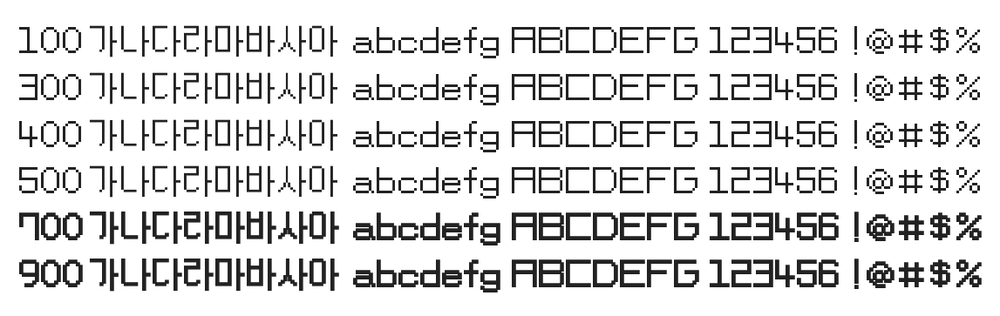

# @noonnu/pf-stardust

PF스타더스트 - 픽셀폰트풍 글씨체



## Install

```bash
npm install @noonnu/pf-stardust --save
```

### Import the CSS file

```js
import '@noonnu/pf-stardust' // esm
// or
require('@noonnu/pf-stardust') // cjs
```

#### [css-loader](https://github.com/webpack-contrib/css-loader)

```css
@import url('~@noonnu/pf-stardust');
```

## Usage

```css
body {
    font-family: PFStardust;
}
```

## Link

https://noonnu.cc/font_page/393
