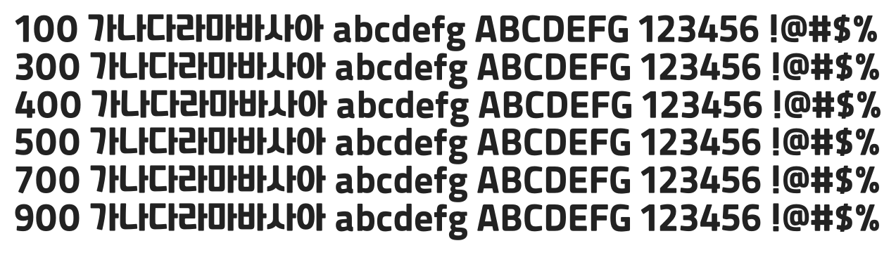

# @noonnu/recipekorea

레코체 - 레시피코리아에서 만든 제목용 폰트



## Install

```bash
npm install @noonnu/recipekorea --save
```

### Import the CSS file

```js
import '@noonnu/recipekorea' // esm
// or
require('@noonnu/recipekorea') // cjs
```

#### [css-loader](https://github.com/webpack-contrib/css-loader)

```css
@import url('~@noonnu/recipekorea');
```

## Usage

```css
body {
    font-family: Recipekorea;
}
```

## Link

https://noonnu.cc/font_page/394
