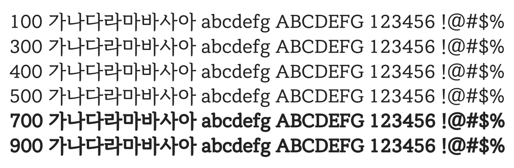

# @noonnu/ridi-batang

리디바탕 - 책에 잘 어울리는 읽기 좋은 글씨체



## Install

```bash
npm install @noonnu/ridi-batang --save
```

### Import the CSS file

```js
import '@noonnu/ridi-batang' // esm
// or
require('@noonnu/ridi-batang') // cjs
```

#### [css-loader](https://github.com/webpack-contrib/css-loader)

```css
@import url('~@noonnu/ridi-batang');
```

## Usage

```css
body {
    font-family: RIDIBatang;
}
```

## Link

https://noonnu.cc/font_page/324
