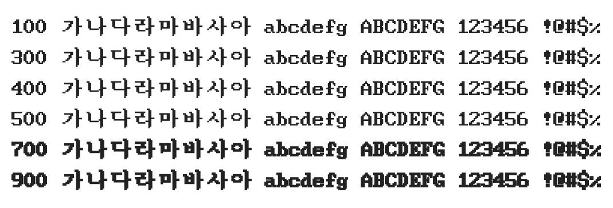

# @noonnu/sam3-kr-font

삼국지3글꼴 - 둥근 해가 떴습니다 자리에서 일어나서



## Install

```bash
npm install @noonnu/sam3-kr-font --save
```

### Import the CSS file

```js
import '@noonnu/sam3-kr-font' // esm
// or
require('@noonnu/sam3-kr-font') // cjs
```

#### [css-loader](https://github.com/webpack-contrib/css-loader)

```css
@import url('~@noonnu/sam3-kr-font');
```

## Usage

```css
body {
    font-family: Sam3KRFont;
}
```

## Link

https://noonnu.cc/font_page/241
