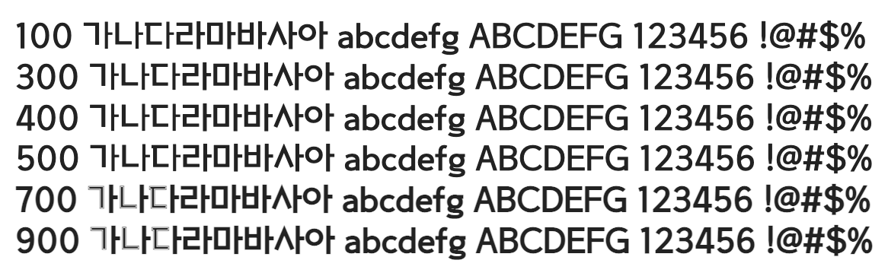

# @noonnu/sangju-haerye

상주해례본체 - 해례본 서체를 본떠 만든 폰트



## Install

```bash
npm install @noonnu/sangju-haerye --save
```

### Import the CSS file

```js
import '@noonnu/sangju-haerye' // esm
// or
require('@noonnu/sangju-haerye') // cjs
```

#### [css-loader](https://github.com/webpack-contrib/css-loader)

```css
@import url('~@noonnu/sangju-haerye');
```

## Usage

```css
body {
    font-family: SANGJUHaerye;
}
```

## Link

https://noonnu.cc/font_page/785
