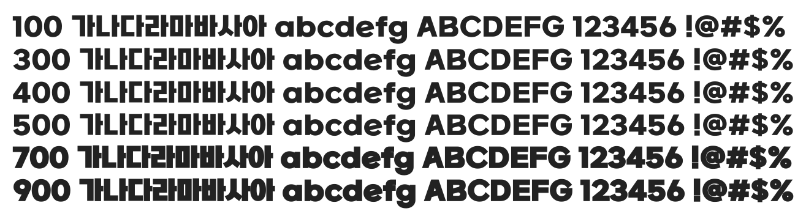

# @noonnu/sb-aggro-b

어그로체 - 어그로가 필요한 순간엔 어그로체를



## Install

```bash
npm install @noonnu/sb-aggro-b --save
```

### Import the CSS file

```js
import '@noonnu/sb-aggro-b' // esm
// or
require('@noonnu/sb-aggro-b') // cjs
```

#### [css-loader](https://github.com/webpack-contrib/css-loader)

```css
@import url('~@noonnu/sb-aggro-b');
```

## Usage

```css
body {
    font-family: SBAggroB;
}
```

## Link

https://noonnu.cc/font_page/738
