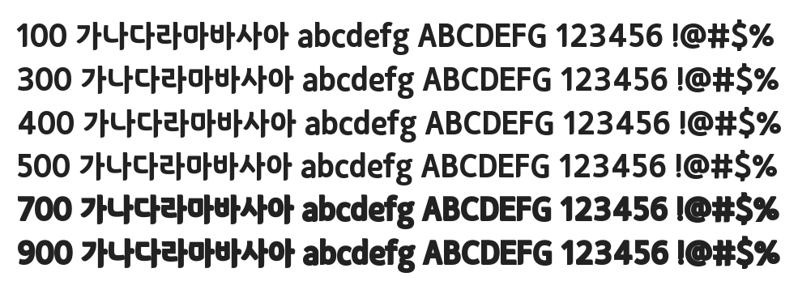

# @noonnu/sd-samliphopangche-basic

산돌 삼립호빵체 Basic - 겨울에는 따뜻한 호빵



## Install

```bash
npm install @noonnu/sd-samliphopangche-basic --save
```

### Import the CSS file

```js
import '@noonnu/sd-samliphopangche-basic' // esm
// or
require('@noonnu/sd-samliphopangche-basic') // cjs
```

#### [css-loader](https://github.com/webpack-contrib/css-loader)

```css
@import url('~@noonnu/sd-samliphopangche-basic');
```

## Usage

```css
body {
    font-family: SDSamliphopangche_Basic;
}
```

## Link

https://noonnu.cc/font_page/507
