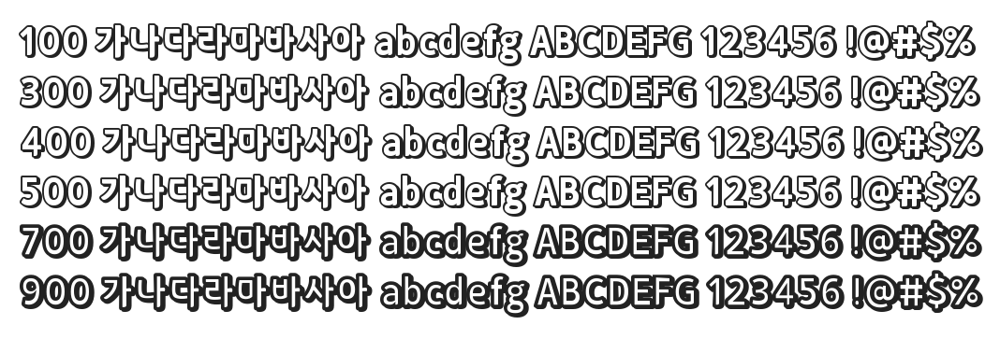

# @noonnu/sd-samliphopangche-outline

산돌 삼립호빵체 Outline - 나는 야채호빵보다 피자호빵이 좋아



## Install

```bash
npm install @noonnu/sd-samliphopangche-outline --save
```

### Import the CSS file

```js
import '@noonnu/sd-samliphopangche-outline' // esm
// or
require('@noonnu/sd-samliphopangche-outline') // cjs
```

#### [css-loader](https://github.com/webpack-contrib/css-loader)

```css
@import url('~@noonnu/sd-samliphopangche-outline');
```

## Usage

```css
body {
    font-family: SDSamliphopangche_Outline;
}
```

## Link

https://noonnu.cc/font_page/508
