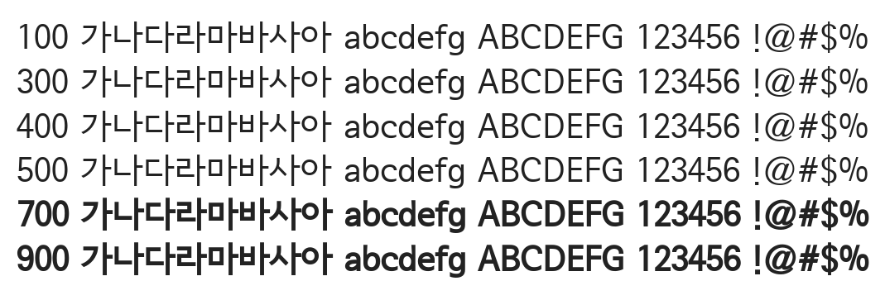

# @noonnu/seoul-namsan-m

서울남산체 - 가을 아침은 내게 커다란 기쁨이야



## Install

```bash
npm install @noonnu/seoul-namsan-m --save
```

### Import the CSS file

```js
import '@noonnu/seoul-namsan-m' // esm
// or
require('@noonnu/seoul-namsan-m') // cjs
```

#### [css-loader](https://github.com/webpack-contrib/css-loader)

```css
@import url('~@noonnu/seoul-namsan-m');
```

## Usage

```css
body {
    font-family: SeoulNamsanM;
}
```

## Link

https://noonnu.cc/font_page/59
