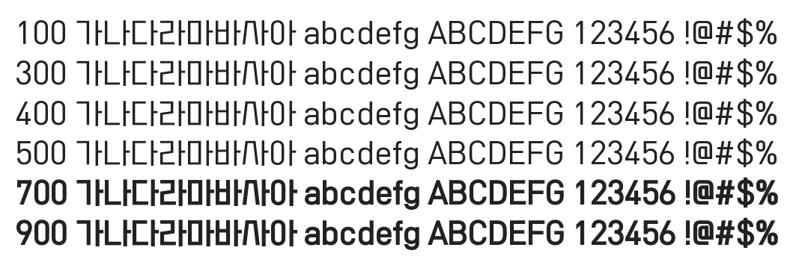

# @noonnu/sf-hail-snow

싸락눈체 - 싸락눈은 눈인지 비인지 잘 모르겠다



## Install

```bash
npm install @noonnu/sf-hail-snow --save
```

### Import the CSS file

```js
import '@noonnu/sf-hail-snow' // esm
// or
require('@noonnu/sf-hail-snow') // cjs
```

#### [css-loader](https://github.com/webpack-contrib/css-loader)

```css
@import url('~@noonnu/sf-hail-snow');
```

## Usage

```css
body {
    font-family: SF_HailSnow;
}
```

## Link

https://noonnu.cc/font_page/689
